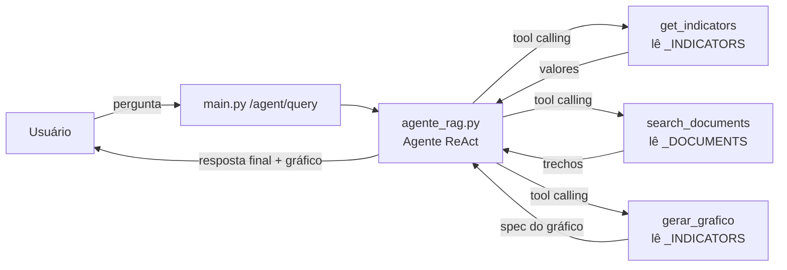

# Assistente Corporativo com IA

API de assistente corporativo que responde perguntas em linguagem natural sobre
indicadores de desempenho (produtividade e retrabalho), combinando um agente de
IA (LangChain) com **tool calling** e integração com LLM via **OpenRouter**.

O agente possui **3 ferramentas (tools)**: `get_indicators`, `search_documents`
e `gerar_grafico`.

---

## 🧠 O que a aplicação faz

O assistente recebe uma pergunta e decide, de forma autônoma, quais das **3
ferramentas** usar para respondê-la:

| Ferramenta | Função |
|---|---|
| `get_indicators` | Consulta os valores numéricos dos indicadores por mês |
| `search_documents` | Busca contexto explicativo nos documentos corporativos |
| `gerar_grafico` | Gera um gráfico (linha/barra) a partir dos indicadores |

As respostas são produzidas por um LLM usando o padrão **ReAct** (raciocina →
chama ferramentas → responde), e os gráficos são renderizados na própria
interface web.

---

## 🚀 Como executar

### 1. Pré-requisitos

- Python 3.10 ou superior
- Uma chave de API da [OpenRouter](https://openrouter.ai/keys)

### 2. Clonar e entrar na pasta

```bash
git clone https://github.com/franciscocostacarneiro/teste-cni-2.git
cd teste-cni-2
```

### 3. Criar e ativar o ambiente virtual (Windows)

```powershell
python -m venv .venv
.\.venv\Scripts\Activate.ps1
```

> Em Linux/macOS: `python -m venv .venv && source .venv/bin/activate`

### 4. Instalar as dependências

```powershell
pip install -r requirements.txt
```

### 5. Configurar a chave da API

```powershell
Copy-Item .env.example .env
```

Abra o arquivo `.env` e preencha sua chave real:

```
OPENROUTER_API_KEY=sk-or-v1-...sua_chave
OPENROUTER_MODEL=openai/gpt-4o-mini
```

### 6. Iniciar a aplicação

```powershell
python -m uvicorn main:app --port 8050
```

### 7. Abrir a interface

Acesse no navegador: **http://127.0.0.1:8050/**

A página exibe as 6 perguntas do estudo de caso, clicáveis, além de um campo
para perguntas livres.

---

## 🔌 API (endpoint)

### `POST /agent/query`

**Entrada:**

```json
{
  "question": "Por que a produtividade caiu em fevereiro?"
}
```

**Saída:**

```json
{
  "answer": "A produtividade caiu em fevereiro...",
  "tools_used": ["get_indicators", "search_documents"],
  "chart": null
}
```

`tools_used` lista as ferramentas que o agente acionou para responder. Quando o
agente gera um gráfico (tool `gerar_grafico`), o campo `chart` contém o spec
(título, tipo, eixos, séries e dados) que o frontend renderiza; caso contrário,
é `null`.

Documentação interativa (Swagger) disponível em `/docs`.

---

## 🧪 Como testar

### Testes automatizados (pytest)

```powershell
python -m pytest -v
```

A suíte cobre:

- **`test_tools.py`** — valida o comportamento das ferramentas
  (`get_indicators`, `search_documents` e `gerar_grafico`) com filtros, ausência
  de resultados, fallback e transformação dos dados do gráfico.
- **`test_api.py`** — valida o endpoint `/agent/query` (estrutura da resposta,
  validação de payload) e a rota do frontend.

### Teste manual via interface web

As 6 perguntas do PRD podem ser testadas diretamente em `http://127.0.0.1:8050/`.
Para testar via terminal:

```powershell
Invoke-RestMethod -Uri "http://127.0.0.1:8050/agent/query" `
  -Method Post `
  -ContentType "application/json" `
  -Body '{"question":"Qual foi a produtividade em fevereiro?"}'
```

---

## 🏗️ Decisões técnicas

- **Framework:** FastAPI para a API + LangChain (`create_agent`) para o agente.
- **Como funciona o agente:** usa o padrão ReAct. A cada pergunta, o LLM decide
  chamar uma ou mais ferramentas, observa os resultados e então gera a resposta final.
- **Seleção de ferramentas:** o prompt de sistema instrui o agente a usar
  `get_indicators` para valores numéricos e `search_documents` para contexto/causas.
  A decisão é feita pelo próprio LLM via tool calling (não há roteamento fixo).
- **Integração com o LLM:** via OpenRouter (`langchain-openai` com `base_url`),
  o que permite trocar o modelo apenas alterando `OPENROUTER_MODEL` no `.env`.
- **Dados:** armazenados como estruturas Python em `tools.py` (indicadores) e em
  memória (documentos) — sem banco de dados, visando simplicidade.
- **Busca em documentos:** por palavras-chave (com stop words), suficiente para o
  corpus pequeno; sem necessidade de embeddings ou banco vetorial.
- **Modelo padrão:** `openai/gpt-4o-mini` (tool calling confiável e rápido).
  Modelos pequenos como `llama-3.1-8b` não executam tools corretamente.

---

## 📁 Estrutura do projeto

```
.
├── agente_rag.py      # Agente corporativo (LangChain + OpenRouter)
├── tools.py           # Dados do PRD + get_indicators e search_documents (@tool)
├── chart_tool.py      # Ferramenta gerar_grafico (@tool) que converte indicadores em gráfico
├── main.py            # API FastAPI + rota do frontend + captura do artifact do gráfico
├── static/index.html  # Interface web com perguntas clicáveis + renderizador de gráficos
├── test_tools.py      # Testes das ferramentas
├── test_api.py        # Testes do endpoint e do frontend
├── requirements.txt   # Dependências
├── .env.example       # Exemplo de variáveis de ambiente
├── langgraph.json     # Configuração do grafo do agente
└── PRD.md             # Enunciado da prova técnica
```

### Descrição de cada arquivo

| Arquivo | O que é | Papel na solução |
|---|---|---|
| [`agente_rag.py`](agente_rag.py) | Código do agente de IA | Define o **prompt de sistema**, cria o cliente do LLM (OpenRouter) e instancia o agente **ReAct** com as três ferramentas. É o "cérebro" da aplicação. |
| [`tools.py`](tools.py) | Dados + ferramentas | **Onde ficam os dados do PRD** (indicadores e documentos). Expõe `@tool` `get_indicators` e `search_documents`. |
| [`chart_tool.py`](chart_tool.py) | Ferramenta de gráficos | Define a `@tool` `gerar_grafico`, que transforma os indicadores em um spec de gráfico (config + dados) devolvido como artifact. |
| [`main.py`](main.py) | API (FastAPI) | Expõe `POST /agent/query`, orquestra a chamada ao agente, extrai as ferramentas usadas **e o artifact do gráfico**, e serve a interface web. |
| [`static/index.html`](static/index.html) | Frontend | Interface com as perguntas clicáveis, chat, campo livre e um **renderizador de gráficos SVG**. |
| [`test_tools.py`](test_tools.py) | Testes | Testes unitários das três ferramentas. |
| [`test_api.py`](test_api.py) | Testes | Testes de integração do endpoint e do frontend. |
| [`requirements.txt`](requirements.txt) | Dependências | Lista de pacotes Python (`fastapi`, `langchain`, `pytest`, etc.). |
| [`.env.example`](.env.example) | Configuração de exemplo | Modelo das variáveis de ambiente (`OPENROUTER_API_KEY`, `OPENROUTER_MODEL`). Copie para `.env`. |
| [`langgraph.json`](langgraph.json) | Configuração do grafo | Aponta o grafo do agente usado pelo runtime LangGraph. |
| [`PRD.md`](PRD.md) | Enunciado | Documento da prova técnica (requisitos e dados de entrada). |

---

## 📊 Onde estão os dados (e como são consumidos)

O PRD fornece dois conjuntos de dados, ambos definidos **dentro de `tools.py`**:

### 1. Indicadores estruturados (tabela)

A tabela de indicadores (mês × indicador × valor) está na variável
`_INDICATORS`:

```python
_INDICATORS = [
    {"month": "Janeiro",   "indicator": "Produtividade", "value": 87},
    {"month": "Fevereiro", "indicator": "Produtividade", "value": 82},
    {"month": "Março",     "indicator": "Produtividade", "value": 91},
    {"month": "Janeiro",   "indicator": "Retrabalho",    "value": 12},
    {"month": "Fevereiro", "indicator": "Retrabalho",    "value": 18},
    {"month": "Março",     "indicator": "Retrabalho",    "value": 10},
]
```

**Consumido por:** a ferramenta `get_indicators()`, que filtra por
`indicator` e/ou `month` e devolve as linhas correspondentes ao agente.

### 2. Documentos corporativos (texto)

Os três documentos (Janeiro, Fevereiro e Março) estão na variável `_DOCUMENTS`:

```python
_DOCUMENTS = [
    {"title": "Documento 1 – Janeiro",  "content": "O indicador de produtividade..."},
    {"title": "Documento 2 – Fevereiro","content": "Em fevereiro ocorreu uma redução..."},
    {"title": "Documento 3 – Março",    "content": "Em março ocorreu recuperação..."},
]
```

**Consumido por:** a ferramenta `search_documents()`, que faz uma busca por
palavras-chave (com remoção de stop words) e devolve os trechos relevantes.

### Fluxo de consumo dos dados



> Os dados estão **embarcados no código** (`tools.py`) por simplicidade, já que
> o corpus é pequeno e fixo. Para escalar, eles poderiam ser movidos para JSON,
> CSV, SQLite ou um banco vetorial (ver Limitações).

---

## ⚠️ Limitações e melhorias futuras

- **Busca simples por palavras-chave** — poderia ser trocada por embeddings + banco
  vetorial (RAG) para corpora maiores ou buscas semânticas.
- **Sem memória de conversa** — cada requisição é independente (stateless); poderia
  usar `checkpointer` para manter histórico por sessão.
- **Tolerância a erros** — tratar timeouts/rate-limits do OpenRouter com retry.
- **Observabilidade** — logging estruturado e métricas de latência por tool call.
